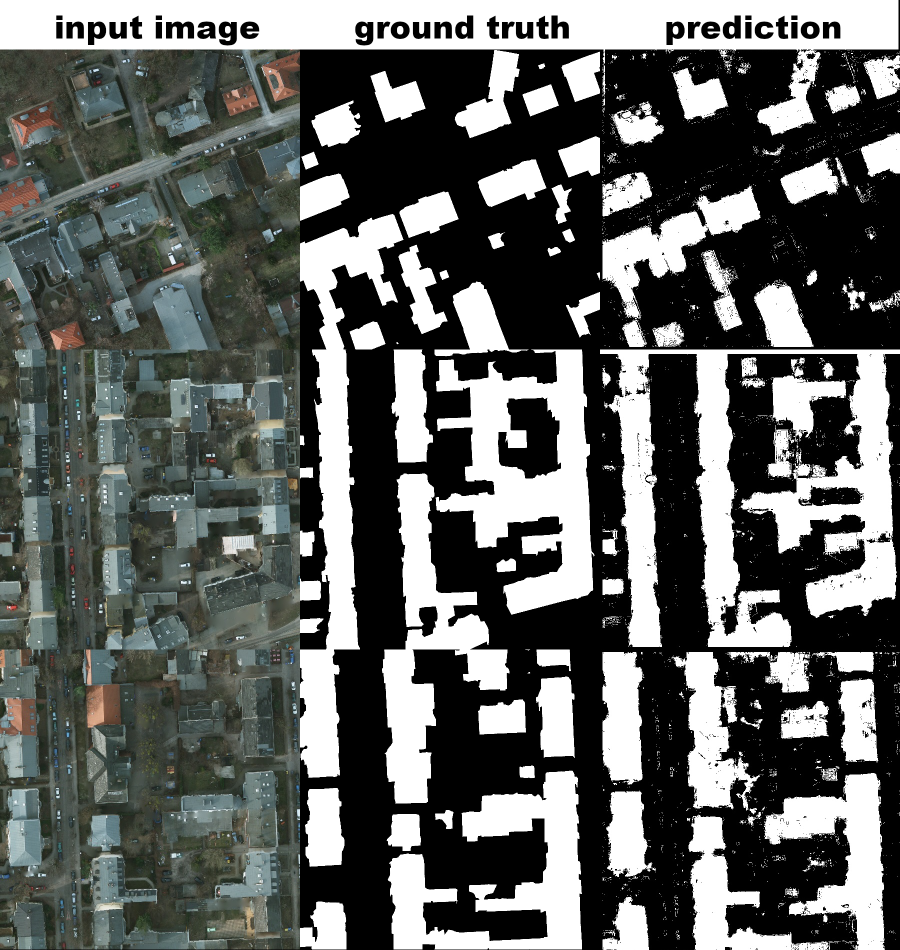

# Machine Learning - Image Segmentation

Per pixel image segmentation using machine learning algorithms. Programmed using the following libraries: Scikit-Learn, Scikit-Image OpenCV, and Mahotas and ProgressBar. Compatible with Python 2.7+ and 3.X.

### Feature vector

Spectral:

* Grey

Texture:

* GLCM texture raster whose parameters are pulled directly in from a json file generated by the user refer to 'glcm_feature_params.json' for a template of how this can be generated. 

Haralick (Co-occurance matrix) features (Also texture):

Contrast
Dissimilarity
Homogeneity
Angular Second Moment
(ASM)
Energy
Correlation

### Supported Learners

* Support Vector Machine using either a chi squared, nystrom non linear approximations or a linear kernel

### Example Usage

python train.py used to train each model in either a grid search pattern or with sepcified parameters given by the user.  -i <path_to_image_folder> -l <path/to/label/folder> -c <SVM, RF, GBC> -o <path/to/model.p> for further details on arguments please refer to the arg parse method "parse_args" present within the script. 

python inference.py used to generate prediction images for each image both in terms of binary prediction images and general analysis
-i <path_to_image_folder> -m <path/to/model.p> -o <path/to/output/folder> -txt <path/to/texture images (numpy format)> -h_lick_p <path/to/json file denoting haralick parameters> -p <path/to/patient substring file> used to filter patient specific files for edge case analysis

gen_analy_report_train_test_curves.py
Script used to generate training curves plots wrt to training set size and number of training iterations. 
  '-rw_r_dir':'source results directory where raw results are read in for analysis',
                        required=True)
  '-dst_dir':'destination directory to write output dataframes and plots from analysis',
  '-trn_data_dir':'source directory where original raw data is read in for additional training curve plot analysis',
  '-tst_data_dir':'source directory where raw test data is read in for additional curve plotting analysis',
  '-txt_params':'source directory to original json of texture features',
  '-t':'Destination path to texture feature files created during analysis'

### Example Output

